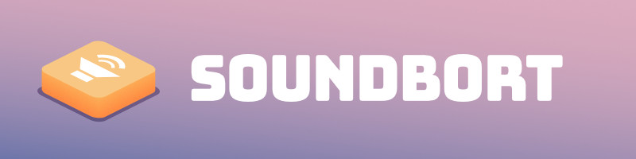

# Getting Started

So you've chosen Soundbort. I hope you like your time with the bot!

Soundbort is a custom soundboard bot for Discord. It's supposed to be as user-friendly as Discord allows it. Help making it better and more user-friendly is always appreciated. If you have improvements, check out the [Contributing ](contributing.md)page. **But first read this guide.**

## Basics

Soundbort offers three different collections of audio samples, _called soundboards_.

* **The standard soundboard**, that's the same for everyone and a starting point if you haven't added your own samples yet
* **Server soundboards**, that the moderators of a Discord server manage and all members of that server can play any sample of that soundboard
* **And personal aka. user soundboards**, that are tied to a discord user and allows them to take their sound samples across servers with them.

If you're a server moderator and are interested in how to restrict modification to your server's soundboard, check out the [Server Moderation Guide ](server-guide.md)page.

