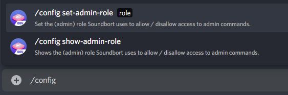

# Server Guide

When Soundbort joins a server, it tries to figure out what the moderator or admin role is. If it can't find a role called "_mod_", "_moderator_", "_moderation_" or "_admin_", "_administrator_", "_administration_" it will default to the highest role. In a server with no roles this will be the _@everyone_ role.

### Setting permissions

If you want to set your own moderator role, **you need to have this role Soundbort chose automatically or admin priviledges** and type `/config set-admin-role` and choose from the list of roles it gives you, then hit enter. You can see what role Soundbort chose when it joined the server by typing `/config show-admin-role` .


Every member who wants to add samples to or remove from the server soundboard has to have admin role.


That's it, you've now disallowed any non-moderator modification of the server's soundboard. 🎉 

### Adding samples to your server soundboard

By default `/upload` always adds samples to your personal soundboard. To add samples to your server soundboard type `/upload name:the sample name [TAB] to:` and choose "_Upload into server soundboard for every member to use._"

Everything else stays the same. You just need to add the `to: server` to your command.


You can only add samples to your server soundboard with the previously set admin/moderation role.


### Showing a list of all server samples

To make Soundbort only show the server soundboard, type `/list from` and choose "Output this server's soundboard only."

### Additional tips

If you have a bigger community I recommend setting up a channel for the list of server samples, or pinning the response to a bot channel. This way users can quickly find and play the samples.

