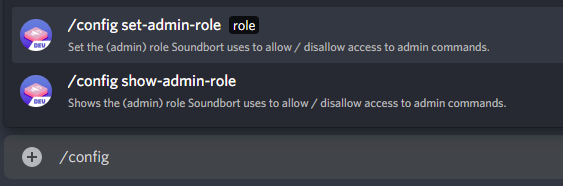

# Server Moderation Guide

When Soundbort joins a server, it tries to figure out what the moderator or admin role is. If it can't find a role called "_mod_", "_moderator_", "_moderation_" or "_admin_", "_administrator_", "_administration_" it will default to the highest role. In a server with no roles this will be the _@everyone_ role.

If you want to set your own moderator role, **you need to have this role Soundbort chose automatically or admin priviledges** and type `/config set-admin-role` and choose from the list of roles it gives you, then hit enter. You can see what role Soundbort chose when it joined the server by typing `/config show-admin-role` .

Every member who wants to add samples to or remove from the server soundboard has to have this role.

That's it, you've now disallowed any non-moderator modification of the server's soundboard. 🎉 

